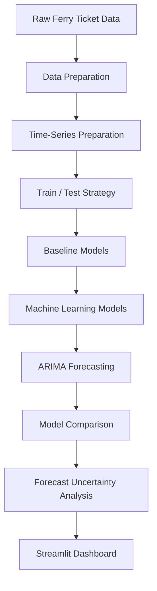

# ⛴️ Short-Term Ferry Ticket Demand Forecasting
## 🚀 Live Demo

[Open the Ferry Ticket Demand Forecasting Dashboard](https://sudeshna52-ferryticket-app-vnokgz.streamlit.app/)
A predictive decision-support system for forecasting short-term Toronto Island ferry ticket demand using statistical and machine learning models.

The project compares multiple forecasting approaches across different forecast horizons and presents the results through an interactive Streamlit dashboard.

---

## 📌 Project Overview

Ferry demand can vary significantly over short periods due to changes in travel patterns and passenger demand.

This project develops a short-term forecasting system that:

- Prepares and analyzes ferry ticket time-series data
- Builds baseline forecasting models
- Trains machine learning models
- Applies ARIMA-based time-series forecasting
- Compares model performance using standard evaluation metrics
- Evaluates forecasts across multiple horizons
- Analyzes forecast uncertainty
- Provides an interactive Streamlit dashboard for decision support

The goal is to help support operational decisions such as ferry scheduling, capacity planning, and crowd management.

> **Note:** The forecasting system is intended as a decision-support tool and does not replace operational judgment.

---

## 🎯 Objectives

The main objectives of this project are:

1. Prepare ferry ticket demand time-series data for forecasting.
2. Establish baseline forecasting models for comparison.
3. Develop machine learning forecasting models.
4. Develop an ARIMA time-series forecasting model.
5. Compare models using MAE, RMSE, and MAPE.
6. Evaluate forecasting performance across different horizons.
7. Analyze forecast uncertainty.
8. Build an interactive dashboard to communicate forecasting results.

---

## ⏱️ Forecast Horizons

The system evaluates short-term demand forecasting at four horizons:

- **15 Minutes**
- **30 Minutes**
- **1 Hour**
- **2 Hours**

The Streamlit dashboard allows users to select the desired forecast horizon and view the corresponding model performance.

---

## 🤖 Models Used

The project compares the following models:

### 1. Naive Forecast

Uses the most recent observed demand as the forecast.

### 2. Moving Average

Uses historical observations to calculate an average demand estimate.

### 3. Linear Regression

Uses a regression-based approach to predict ferry ticket demand.

### 4. Random Forest

A tree-based machine learning model used to capture nonlinear relationships in the data.

### 5. Gradient Boosting

A boosting-based machine learning model used for demand prediction.

### 6. ARIMA

An autoregressive integrated moving average model designed specifically for time-series forecasting.

---

## 📊 Evaluation Metrics

Model performance is evaluated using:

### Mean Absolute Error (MAE)

Measures the average absolute difference between actual and predicted demand.

Lower MAE indicates better performance.

### Root Mean Squared Error (RMSE)

Measures the square root of the average squared prediction error.

Lower RMSE indicates better performance and gives greater weight to larger errors.

### Mean Absolute Percentage Error (MAPE)

Measures prediction error as a percentage of actual demand.

Lower MAPE indicates better performance.

MAPE can become unstable when actual demand values are very small or close to zero, so it is interpreted alongside MAE and RMSE.

---

## 🏆 Model Performance

The dashboard evaluates all models for each forecast horizon.

For example, for the **15-minute horizon**, ARIMA achieves:

| Model | MAE | RMSE |
|---|---:|---:|
| Naive | 53.5638 | 116.7628 |
| Moving Average | 53.1003 | 116.4231 |
| Linear Regression | 20.0267 | 64.8290 |
| Random Forest | 18.1691 | 64.2961 |
| Gradient Boosting | 17.3479 | 62.9239 |
| **ARIMA** | **7.1539** | **7.1539** |

ARIMA provides the strongest performance among the evaluated models for this horizon based on MAE and RMSE.

Performance is also evaluated separately for the 30-minute, 1-hour, and 2-hour horizons through the dashboard.

---

## 📈 Streamlit Dashboard

The project includes an interactive Streamlit application for exploring the forecasting results.

The dashboard provides:

- Forecast horizon selection
- Best-performing model
- MAE
- RMSE
- MAPE
- Model comparison tables
- MAE comparison visualizations
- Forecast visualizations
- Forecast uncertainty analysis
- Operational decision-support information

### Dashboard Views

Users can select:

```text
15 Minutes
30 Minutes
1 Hour
2 Hours
```

## Project Workflow



## Technologies Used
- Python
- Pandas
- NumPy
- Matplotlib
- Scikit-learn
- Statsmodels
- Streamlit
## 📦 Installation
### Clone the repository:
```Bash
git clone https://github.com/sudeshna52/FerryTicket.git
```

### Move into the project directory:
```Bash
cd FerryTicket 
```
### Install the required dependencies:
```Bash
pip install -r requirements.txt
```
### ▶️ Run the Streamlit Application
Run:
`Bash
python -m streamlit run app.py
`

### The application will open in the browser at:
`http://localhost:8501
`

### ☁️ Deployment
`The Streamlit dashboard can be deployed using Streamlit Community Cloud.
Deployment configuration:
Repository: sudeshna52/FerryTicket
Branch: main
Main file: app.py
The dependencies are specified in: requirements.txt
`
